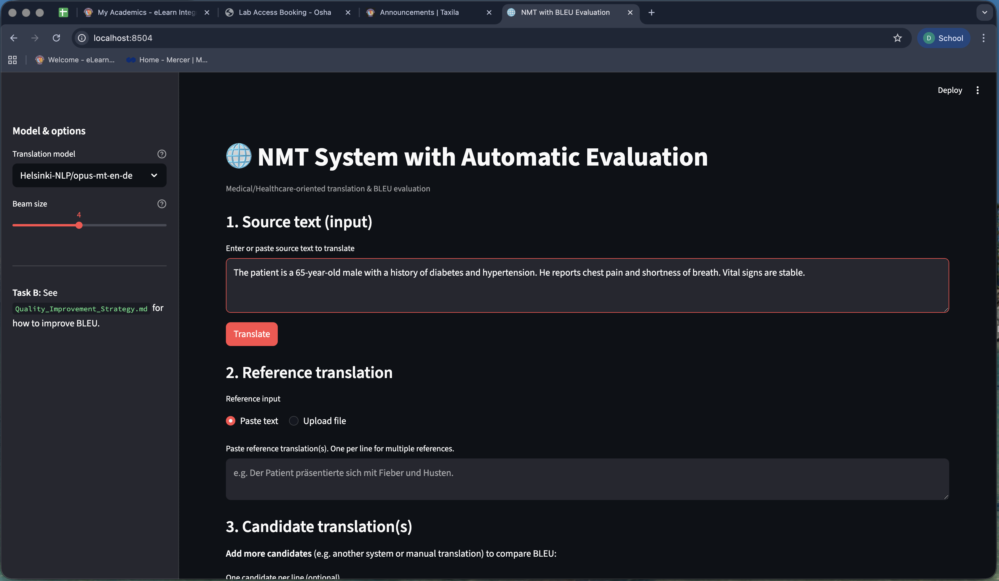
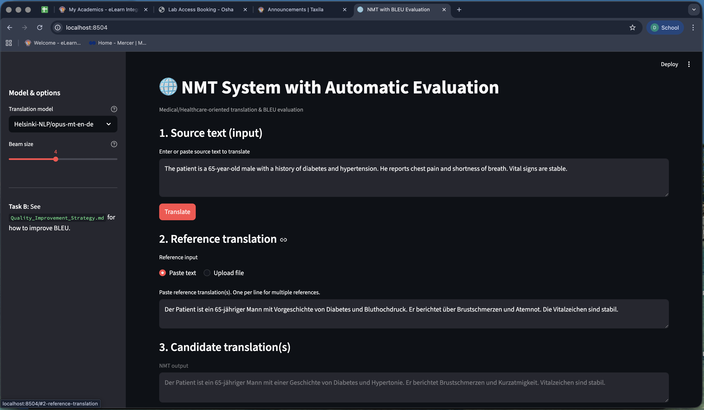
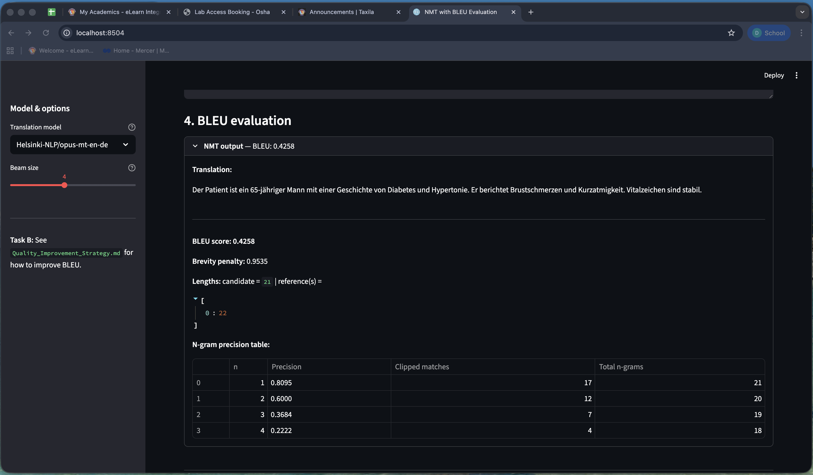
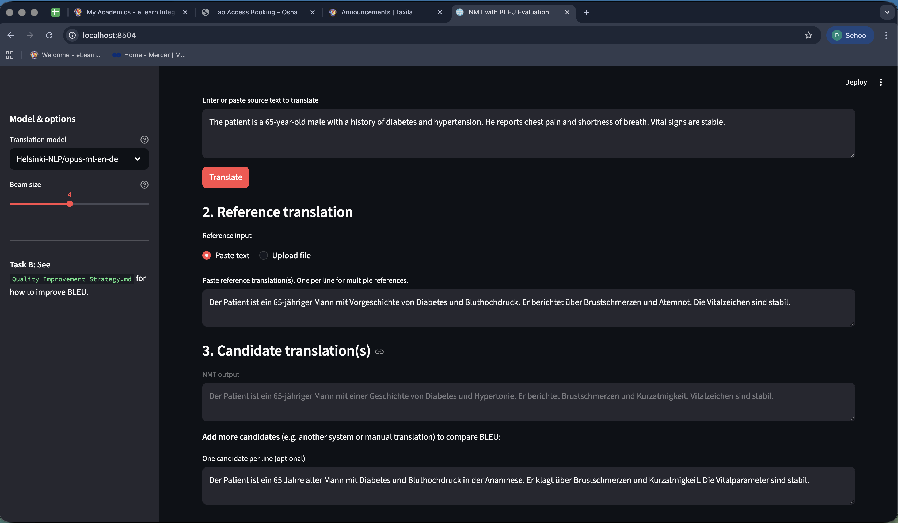
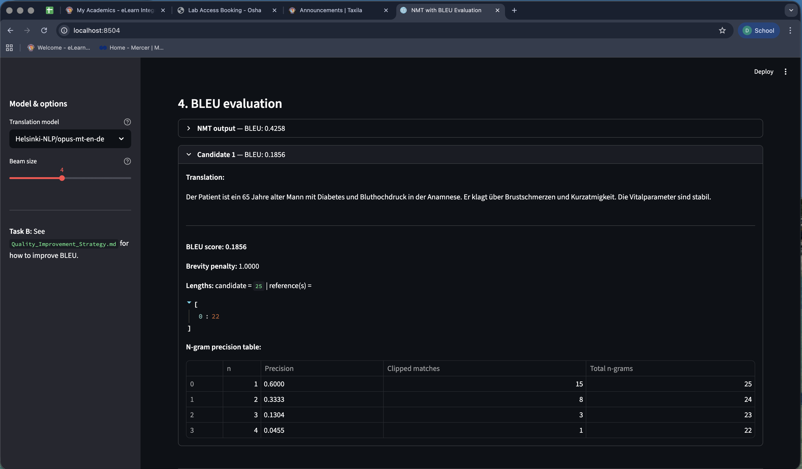
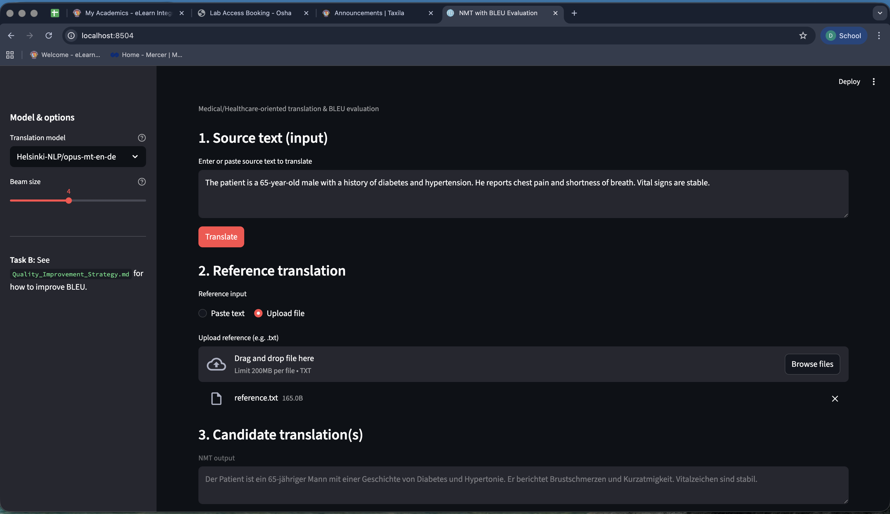

# Design Report

**Project:** Neural Machine Translation with BLEU Evaluation  
**Focus:** Medical/Healthcare text

---

## Team Members

| Name | Roll Number |
|------|-------------|
| Arpan Ghosh | 2024AA05807 |
| Deb Adarsh Sahu | 2024AA05072 |
| Satyajit Panigrahi | 2024AA05089 |
| Sridhar R | 2024AA05357 |
| Sumangala B S | 2023AC05941 |

**Group:** 67

---

## Why We Made These Choices

### Streamlit for the UI

We went with Streamlit instead of building a Flask app with separate HTML/CSS. It's all Python, which made development faster and kept the codebase simple. The built-in components (text areas, file upload, tables) were exactly what we needed. The trade-off is less control over styling, but for a demo app that's fine.

### MarianMT for Translation

We used Helsinki-NLP's MarianMT models through Hugging Face. These are proper Transformer models (6-layer encoder-decoder), pretrained on huge parallel corpora. They work out of the box — no training needed on our end. We picked models for common language pairs (en-de, en-es, en-fr) that would be relevant for medical translation scenarios.

Could we have trained our own model? Sure, but that would take days of GPU time and a lot of parallel medical data. Using pretrained models let us focus on the integration and evaluation parts.

### Custom BLEU Implementation

The assignment specifically asks for:
- Modified n-gram precision
- Brevity penalty
- N-gram precision table (1-gram, 2-gram, etc.)

We could have used sacrebleu or nltk, but they don't expose the intermediate values we needed for the table. So we wrote BLEU from scratch in `bleu_utils.py`. It follows the standard formula — geometric mean of clipped n-gram precisions times the brevity penalty.

---

## Challenges We Ran Into

### Model Download Time

The first time you pick a model, Hugging Face downloads it (~300MB). This makes the first translation slow. We added a spinner so users know something's happening, and the model gets cached for future runs.

### Tokenization Mismatch

BLEU scores depend heavily on how you tokenize. MarianMT uses subword tokenization internally, but the output is normal text. We tokenize both the NMT output and the reference with simple whitespace splitting before computing BLEU. This keeps things consistent and matches how BLEU is typically reported.

### Medical Domain

The pretrained models are general-purpose — they weren't trained specifically on medical text. Medical terminology might not translate as well as everyday language. We mention in Task B that fine-tuning on medical data would help, but we didn't implement that here since it's beyond the scope.

---

## How NMT is Integrated

The flow is straightforward:

1. User types source text and picks a model from the sidebar
2. Clicks "Translate"
3. `app.py` calls `nmt_service.translate()` with the text and model name
4. `nmt_service` loads the Hugging Face pipeline (cached after first load) and runs inference
5. Translated text comes back and gets displayed
6. If there's a reference, `bleu_utils.compute_bleu()` calculates the score and n-gram table
7. Everything shows up in the UI

The code is modular — if we wanted to swap in a different model or a fine-tuned version, we'd just change the model name string.

---

## Screenshots

### Main Interface

The home screen with source text area, reference section, and model selector in the sidebar.

---

### After Translation

  
NMT output displayed after clicking Translate.

---

### BLEU Results

The evaluation section showing BLEU score, brevity penalty, and the n-gram precision table with all four rows (1-gram through 4-gram).

---

### Comparing Multiple Candidates

Two or more candidates with their individual BLEU scores, showing how different translations compare.

---

### File Upload

Using "Upload file" to provide the reference translation instead of pasting.

---
